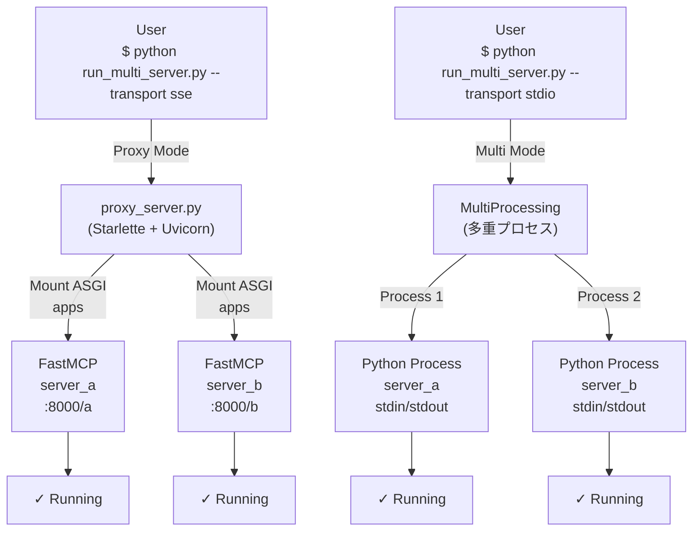

# MCP改善: 複数サーバ階層レイアウト方式

このディレクトリは、最新形式として「MCPサーバごとの配下に `Tools` / `Prompts` / `Resource` を置く」構成のみを採用します。

## 採用する唯一の構成

```text
mcp_servers/
    mcp_server_a/
        server.json          ← サーバーメタデータ（オプション）
        Tools/
            calc.py
        Prompts/
            summarize.py
        Resource/
            profile.py
    mcp_server_b/
        server.json          ← 配置なしでも起動可能
        Tools/
        Prompts/
        Resource/
    ...
    mcp_server_m/
        server.json
        Tools/
        Prompts/
        Resource/
```

- `server.json` はサーバーのメタデータを定義（オプション、配置しない場合は`server://info`でエラーを返します）
- 各 `.py` は `register(server)` を実装します。
- `Resource` は `Resources`、`Tools` は `Tool`、`Prompts` は `Prompt` でも読めます。

## ロードフロー

使用する Transport により異なります。

### Proxy Mode（SSE / Streamable-HTTP）
1. `run_multi_server.py` が起動（transport: sse or streamable-http）
2. `proxy_server.py` をサブプロセスで実行
3. すべてのサーバーを同一プロセス内でビルド
4. FastMCP の ASGI アプリケーションとして Starlette にマウント
5. Uvicorn で **1つのポート（8000）** で複数サーバーをパスベース公開
   - `http://localhost:8000/server_a/mcp`
   - `http://localhost:8000/server_b/mcp`

### Multi Mode（STDIO）
1. `run_multi_server.py` が起動（transport: stdio）
2. 各サーバーを **別々のプロセス（`multiprocessing.Process`）** で同時実行
3. 各プロセスが独立した標準入出力を持つ（**ポート不要**）
4. 各プロセス内で：
   - `multi_server_loader.py` がサーバディレクトリを読み込み
   - `server.json` のメタデータを取得
   - `Tools` / `Prompts` / `Resource` の `.py` をimport
   - 各モジュールの `register(server)` を実行
   - FastMCP サーバーを STDIO transport で起動

### アーキテクチャ図



## 実行方法

### Transport による自動モード選択

`--transport` 値により自動的に実行モードが決まります：

| Transport | Mode | 用途 |
|-----------|------|------|
| `sse` (デフォルト) | Proxy | **推奨** 本番・テスト共通（ポート: 8000） |
| `streamable-http` | Proxy | 双方向通信が必要な場合（ポート: 8000） |
| `stdio` | Multi | 開発時に各サーバを独立実行（ポート不要） |

### 実行例

**Proxy Mode（推奨）- SSE transport（デフォルト）**
```bash
# すべてのサーバーを単一ポートで公開
python run_multi_server.py

# 特定のサーバーのみ
python run_multi_server.py --server server_a server_b

# ホスト・ポートを指定
python run_multi_server.py --host 0.0.0.0 --port 9000

# Streamable-HTTP transport を使用
python run_multi_server.py --transport streamable-http
```

**Multi Mode - STDIO transport（開発用）**
```bash
# 各サーバーを独立したプロセスで実行
python run_multi_server.py --transport stdio

# 特定のサーバーのみ
python run_multi_server.py --transport stdio --server server_a server_b
```

### URL パスのカスタマイズ

Proxy モード時、`server.json` に `path` フィールドを指定してURL パスをカスタマイズできます：

```json
{
  "name": "mcp_server_a",
  "path": "api/v1/chat",      ← URL パスを指定
  "version": "1.0.0",
  "description": "Sample MCP server",
  "capabilities": {
    "tools": true,
    "prompts": true,
    "resources": true
  }
}
```

- `path` 未指定の場合 → サーバー名（`mcp_server_a`）がパスになります
- Multi モード（stdio）では無視されます

**例：**
```
http://localhost:8000/api/v1/chat/mcp  ← path="api/v1/chat" の場合
http://localhost:8000/server_a/mcp      ← path 未指定の場合
```

## 管理機能
- **Resource: `server://info`** — server.json から取得したサーバーメタデータ（JSON形式）
- **Resource: `layout://load-report`** — モジュール読み込み結果のレポート
- **Tool: `layout_list`** — 読み込んだモジュール一覧（JSON形式）

`server://info` で、サーバーのメタデータ（バージョン、説明、機能など）を確認できます。

## ファイル一覧
- `multi_server_loader.py`: 階層レイアウトローダ本体
- `run_multi_server.py`: マルチ/プロキシ起動スクリプト（メインエントリーポイント）
- `proxy_server.py`: パスベースプロキシサーバー実装
- `mcp_servers/mcp_server_a/`: サンプルサーバ構成
  - `server.json`: メタデータファイル（オプション）
  - `Tools/calc.py`: ツール実装例
  - `Prompts/summarize.py`: プロンプト実装例
  - `Resource/profile.py`: リソース実装例
- `mcp_layout_proposal.md`: 方式検討メモ

## server.json の形式
各サーバーディレクトリに `server.json` を配置してメタデータを定義します。（**オプション**）

```json
{
  "name": "mcp_server_a",
  "version": "1.0.0",
  "description": "Server description",
  "author": "Author name",
  "capabilities": {
    "tools": true,
    "prompts": true,
    "resources": true
  },
  "features": [
    "feature1",
    "feature2"
  ]
}
```

### フィールド説明
- `name`: サーバー名（任意）
- `version`: バージョン番号（任意）
- `description`: サーバーの説明（任意）
- `author`: 作成者（任意）
- `capabilities`: 有効な機能（任意）
- `features`: このサーバーが提供する機能リスト（任意）

### 備考
- `server.json` がない場合、`server://info` は `{"name": "<server_name>", "error": "No server.json found"}` を返します。
- `server.json` は有効なJSONである必要があります。パース失敗時はエラー例外が発生します。
