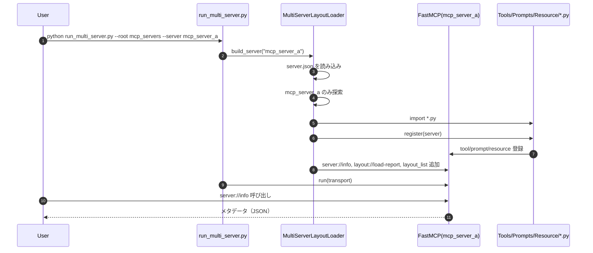

# MCP改善: 複数サーバ階層レイアウト方式

このディレクトリは、最新形式として「MCPサーバごとの配下に `Tools` / `Prompts` / `Resource` を置く」構成のみを採用します。

## 採用する唯一の構成

```text
mcp_servers/
    mcp_server_a/
        server.json          ← サーバーメタデータ（オプション）
        Tools/
            calc.py
        Prompts/
            summarize.py
        Resource/
            profile.py
    mcp_server_b/
        server.json          ← 配置なしでも起動可能
        Tools/
        Prompts/
        Resource/
    ...
    mcp_server_m/
        server.json
        Tools/
        Prompts/
        Resource/
```

- `server.json` はサーバーのメタデータを定義（オプション、配置しない場合は`server://info`でエラーを返します）
- 各 `.py` は `register(server)` を実装します。
- `Resource` は `Resources`、`Tools` は `Tool`、`Prompts` は `Prompt` でも読めます。

## ロードフロー
1. `run_multi_server.py` が対象サーバ名を受け取る。
2. `multi_server_loader.py` が対象サーバフォルダのみ探索する。
3. `server.json` を読み込みメタデータを取得する。（ファイルがない場合は省略）
4. `Tools` / `Prompts` / `Resource` の `.py` を順にimportする。
5. 各モジュールの `register(server)` を実行する。
6. 管理用 `server://info`、`layout://load-report`、`layout_list` を登録する。
7. 指定transportでサーバを起動する。

### シーケンス図 (Mermaid)


## 実行方法
前提: `mcp` パッケージがインストール済み。

```bash
cd mcpの改善
python run_multi_server.py --root mcp_servers --server mcp_server_a --transport stdio
```

## 管理機能
- **Resource: `server://info`** — server.json から取得したサーバーメタデータ（JSON形式）
- **Resource: `layout://load-report`** — モジュール読み込み結果のレポート
- **Tool: `layout_list`** — 読み込んだモジュール一覧（JSON形式）

`server://info` で、サーバーのメタデータ（バージョン、説明、機能など）を確認できます。

## ファイル一覧
- `multi_server_loader.py`: 階層レイアウトローダ本体
- `run_multi_server.py`: サーバ指定起動スクリプト
- `mcp_servers/mcp_server_a/`: サンプルサーバ構成
  - `server.json`: メタデータファイル（オプション）
  - `Tools/calc.py`: ツール実装例
  - `Prompts/summarize.py`: プロンプト実装例
  - `Resource/profile.py`: リソース実装例
- `mcp_layout_proposal.md`: 方式検討メモ

## server.json の形式
各サーバーディレクトリに `server.json` を配置してメタデータを定義します。（**オプション**）

```json
{
  "name": "mcp_server_a",
  "version": "1.0.0",
  "description": "Server description",
  "author": "Author name",
  "capabilities": {
    "tools": true,
    "prompts": true,
    "resources": true
  },
  "features": [
    "feature1",
    "feature2"
  ]
}
```

### フィールド説明
- `name`: サーバー名（任意）
- `version`: バージョン番号（任意）
- `description`: サーバーの説明（任意）
- `author`: 作成者（任意）
- `capabilities`: 有効な機能（任意）
- `features`: このサーバーが提供する機能リスト（任意）

### 備考
- `server.json` がない場合、`server://info` は `{"name": "<server_name>", "error": "No server.json found"}` を返します。
- `server.json` は有効なJSONである必要があります。パース失敗時はエラー例外が発生します。
