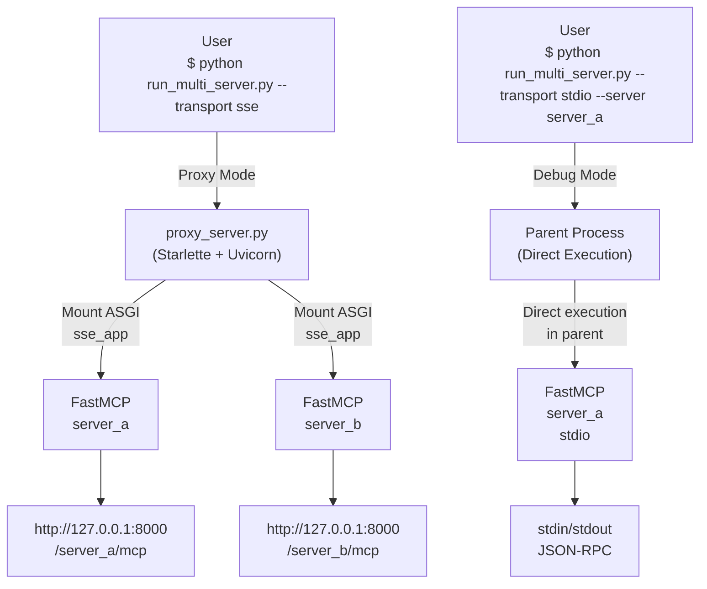

# MCP改善: 複数サーバ階層レイアウト方式

このディレクトリは、最新形式として「MCPサーバごとの配下に `Tools` / `Prompts` / `Resource` を置く」構成のみを採用します。

## 本番デプロイ資料

- 本番手順書: `docs/production-deploy-guide.md`
- Docker Compose サンプル: `deploy/docker/docker-compose.prod.yml`
- Kubernetes サンプル: `deploy/k8s/`
- Copilot MCP 登録サンプル: `deploy/copilot/mcp-settings-http-sse.example.json`

## 採用する唯一の構成

```text
mcp_servers/
    mcp_server_a/
        server.json          ← サーバーメタデータ（オプション）
        Tools/
            calc.py
        Prompts/
            summarize.py
        Resource/
            profile.py
    mcp_server_b/
        server.json          ← 配置なしでも起動可能
        Tools/
        Prompts/
        Resource/
    ...
    mcp_server_m/
        server.json
        Tools/
        Prompts/
        Resource/
```

- `server.json` はサーバーのメタデータを定義（オプション、配置しない場合は`server://info`でエラーを返します）
- 各 `.py` は `register(server)` を実装します。
- `Resource` は `Resources`、`Tools` は `Tool`、`Prompts` は `Prompt` でも読めます。

## ロードフロー

使用する Transport により異なります。

### Proxy Mode（SSE / Streamable-HTTP）
1. `run_multi_server.py` が起動（transport: sse or streamable-http）
2. `proxy_server.py` をサブプロセスで実行
3. すべてのサーバーを同一プロセス内でビルド
4. FastMCP の ASGI アプリケーション（`sse_app()`）として Starlette にマウント
5. Uvicorn で **1つのポート（8000）** で複数サーバーをパスベース公開
   - `http://localhost:8000/server_a/mcp`
   - `http://localhost:8000/server_b/mcp`

### Debug Mode（STDIO）
**注意: Stdio モードは単一サーバのみをサポートします**

1. `run_multi_server.py` が起動（transport: stdio, --server で単一サーバを指定）
2. 親プロセス内で直接 FastMCP サーバーを起動
3. stdin/stdout/stderr が親プロセスと自動的に共有される
4. JSON-RPC メッセージの双方向通信が可能
5. **開発・デバッグ用** - MCPクライアントが直接 stdin/stdout を使用して通信

### アーキテクチャ図



## 実行方法

### Transport による自動モード選択

`--transport` 値により自動的に実行モードが決まります：

| Transport | Mode | 用途 | 複数サーバ | ポート |
|-----------|------|------|---------|--------|
| `sse` (デフォルト) | Proxy | **推奨** 本番・テスト共通 | ✅ 対応 | 8000 |
| `streamable-http` | Proxy | 双方向通信が必要な場合 | ✅ 対応 | 8000 |
| `stdio` | Debug | 開発時・デバッグ用（単一サーバのみ） | ❌ 非対応 | 不要 |

### 実行例

**Proxy Mode（推奨）- SSE transport（デフォルト）**
```bash
# すべてのサーバーを単一ポートで公開
python run_multi_server.py

# 特定のサーバーのみ
python run_multi_server.py --server server_a server_b

# ホスト・ポートを指定
python run_multi_server.py --host 0.0.0.0 --port 9000

# Streamable-HTTP transport を使用
python run_multi_server.py --transport streamable-http
```

**Debug Mode - STDIO transport（開発用・単一サーバのみ）**

⚠️ **注意**: Stdio モードは単一サーバのみをサポートします。`--server` パラメータで**必ず1つのサーバを指定**してください。

```bash
# 単一サーバをデバッグモードで実行（親プロセス内で直接実行）
python run_multi_server.py --transport stdio --server mcp_server_a

# 出力例：
# Debug Mode (stdio): Starting mcp_server_a
# [サーバー出力がここに表示されます]
# [JSON-RPC メッセージの処理...]
```

**特徴：**
- ✅ 親プロセス内で直接実行（subprocess 不要）
- ✅ stdin/stdout/stderr が自動的に共有される
- ✅ MCPクライアントが直接通信可能（JSON-RPC）
- ✅ 開発・デバッグに最適
- ❌ 複数サーバは非対応（Proxy Mode を使用してください）

**認可の失敗例：**
```bash
# ❌ エラー: サーバー指定なし
python run_multi_server.py --transport stdio
# → "Stdio mode requires exactly one --server. Available: mcp_server_a"

# ❌ エラー: 複数サーバ指定（Stdio モードは単一のみ）
python run_multi_server.py --transport stdio --server server_a server_b
# → "Stdio mode requires exactly one --server. Available: mcp_server_a, mcp_server_b"
```

### URL パスのカスタマイズ

Proxy モード時、`server.json` に `path` フィールドを指定してURL パスをカスタマイズできます：

```json
{
  "name": "mcp_server_a",
  "path": "api/v1/chat",      ← URL パスを指定
  "version": "1.0.0",
  "description": "Sample MCP server",
  "capabilities": {
    "tools": true,
    "prompts": true,
    "resources": true
  }
}
```

- `path` 未指定の場合 → サーバー名（`mcp_server_a`）がパスになります
- Multi モード（stdio）では無視されます

**例：**
```
http://localhost:8000/api/v1/chat/mcp  ← path="api/v1/chat" の場合
http://localhost:8000/server_a/mcp      ← path 未指定の場合
```

## 管理機能
- **Resource: `server://info`** — server.json から取得したサーバーメタデータ（JSON形式）
- **Resource: `layout://load-report`** — モジュール読み込み結果のレポート
- **Tool: `layout_list`** — 読み込んだモジュール一覧（JSON形式）

`server://info` で、サーバーのメタデータ（バージョン、説明、機能など）を確認できます。

## ファイル一覧
- `multi_server_loader.py`: 階層レイアウトローダ本体
- `run_multi_server.py`: マルチ/プロキシ起動スクリプト（メインエントリーポイント）
- `proxy_server.py`: パスベースプロキシサーバー実装
- `mcp_servers/mcp_server_a/`: サンプルサーバ構成
  - `server.json`: メタデータファイル（オプション）
  - `Tools/calc.py`: ツール実装例
  - `Prompts/summarize.py`: プロンプト実装例
  - `Resource/profile.py`: リソース実装例
- `mcp_layout_proposal.md`: 方式検討メモ

## server.json の形式
各サーバーディレクトリに `server.json` を配置してメタデータを定義します。（**オプション**）

```json
{
  "name": "mcp_server_a",
  "version": "1.0.0",
  "description": "Server description",
  "author": "Author name",
  "capabilities": {
    "tools": true,
    "prompts": true,
    "resources": true
  },
  "features": [
    "feature1",
    "feature2"
  ]
}
```

### フィールド説明
- `name`: サーバー名（任意）
- `version`: バージョン番号（任意）
- `description`: サーバーの説明（任意）
- `author`: 作成者（任意）
- `capabilities`: 有効な機能（任意）
- `features`: このサーバーが提供する機能リスト（任意）

### 備考
- `server.json` がない場合、`server://info` は `{"name": "<server_name>", "error": "No server.json found"}` を返します。
- `server.json` は有効なJSONである必要があります。パース失敗時はエラー例外が発生します。

## Stdio モード（Debug Mode）の詳細

### 単一サーバのみをサポート
Stdio モードは開発・デバッグ用途として、**単一サーバのみをサポート**します。複数サーバが必要な場合は Proxy Mode (SSE) を使用してください。

### stdin/stdout の直接共有
Stdio モードでサーバを起動すると、親プロセスとサーバーの stdin/stdout が直接接続されます：

```bash
$ python run_multi_server.py --transport stdio --server mcp_server_a

Debug Mode (stdio): Starting mcp_server_a
[親プロセスからのJSON-RPCリクエスト]
↓
[サーバーがJSON-RPCメッセージを処理]
↓
[レスポンスが返される]
```

**特徴：**
- ✅ 親プロセス内で直接実行（subprocess 不要）
- ✅ stdin/stdout/stderr を自動的に受け継ぐ
- ✅ MCPクライアントが直接 stdin/stdout でサーバーと通信可能
- ✅ KeyboardInterrupt (Ctrl+C) で安全に終了
- ❌ MCPサーバーのコンソール出力はクライアントと混在する可能性あり

### 実装詳細
- `build.server.run(transport="stdio")` を親プロセス内で直接呼び出し
- stdin/stdout/stderr は親プロセスから継承
- JSON-RPC メッセージは stdin/stdout で送受信されます
