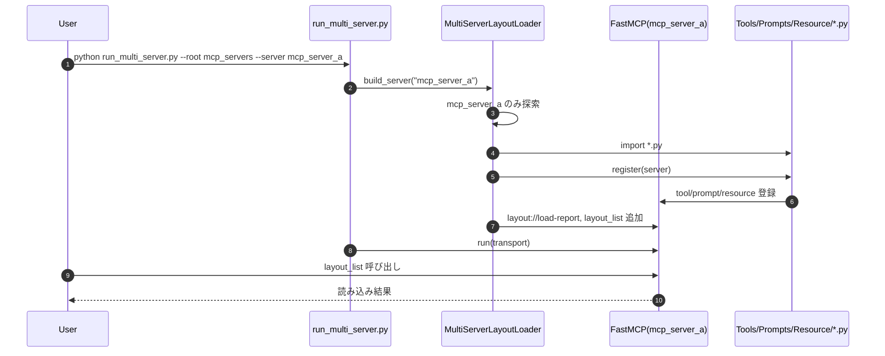

# MCP改善: 複数サーバ階層レイアウト方式

このディレクトリは、最新形式として「MCPサーバごとの配下に `Tools` / `Prompts` / `Resource` を置く」構成のみを採用します。

## 採用する唯一の構成

```text
mcp_servers/
    mcp_server_a/
        Tools/
            calc.py
        Prompts/
            summarize.py
        Resource/
            profile.py
    mcp_server_b/
        Tools/
        Prompts/
        Resource/
    ...
    mcp_server_m/
        Tools/
        Prompts/
        Resource/
```

- 各 `.py` は `register(server)` を実装します。
- `Resource` は `Resources`、`Tools` は `Tool`、`Prompts` は `Prompt` でも読めます。

## ロードフロー
1. `run_multi_server.py` が対象サーバ名を受け取る。
2. `multi_server_loader.py` が対象サーバフォルダのみ探索する。
3. `Tools` / `Prompts` / `Resource` の `.py` を順にimportする。
4. 各モジュールの `register(server)` を実行する。
5. 管理用 `layout://load-report` と `layout_list` を登録する。
6. 指定transportでサーバを起動する。

### シーケンス図 (Mermaid)


## 実行方法
前提: `mcp` パッケージがインストール済み。

```bash
cd mcpの改善
python run_multi_server.py --root mcp_servers --server mcp_server_a --transport stdio
```

## 管理機能
- Resource: `layout://load-report`
- Tool: `layout_list`

`layout_list` で、読み込んだモジュールの成否とエラー内容を確認できます。

## ファイル一覧
- `multi_server_loader.py`: 階層レイアウトローダ本体
- `run_multi_server.py`: サーバ指定起動スクリプト
- `mcp_servers/mcp_server_a/`: サンプルサーバ構成
- `mcp_layout_proposal.md`: 方式検討メモ
